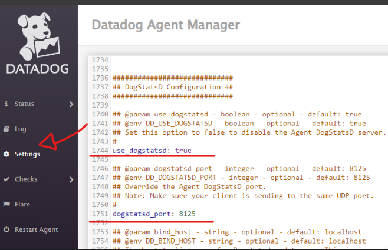
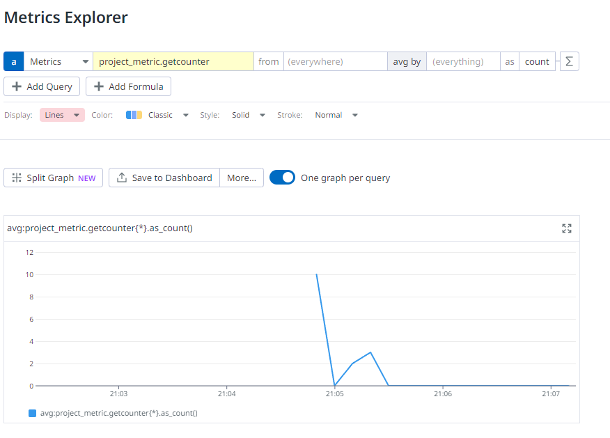

# Datadog metrics

## Signup and install agent

Sign up for a free Datadog [here](https://app.datadoghq.com/signup).

Follow the steps and intall the agent.

To access the agent go to: [Datadog Agent](http://127.0.0.1:5002/).

More info: [quickstart](https://app.datadoghq.com/help/quick_start)

## How to use

### Agent

First check if the agent has dogstatsd enabled on the [agent](http://127.0.0.1:5002/):



More about DogStatsD here: [dotnet tutorial](https://docs.datadoghq.com/metrics/custom_metrics/dogstatsd_metrics_submission/?code-lang=dotnet).

### Code side

Real code is a little different from the README.md code.

First we need this lib to send the metrics: [C# dotnet lib to send metrics](https://github.com/DataDog/dogstatsd-csharp-client)

Add it to the .csproj file:
```xml
<Project Sdk="Microsoft.NET.Sdk.Web">

  <ItemGroup>
    <!-- we need this: -->
    <PackageReference Include="DogStatsD-CSharp-Client" Version="8.0.0" />
  </ItemGroup>

</Project>

```
Then we need all this (check the real code for more information):

```csharp
using StatsdClient;

// we need this:
var dogstatsdConfig = new StatsdConfig
{
    StatsdServerName = "127.0.0.1",
    StatsdPort = 8125, // this is the default, no need to set it
};

app.MapGet("/the-get", () =>
{
    // and this:
    using var dogStatsdService = new DogStatsdService();

    if (!dogStatsdService.Configure(dogstatsdConfig))
    {
        throw new InvalidOperationException("Cannot initialize DogstatsD. Set optionalExceptionHandler argument in the `Configure` method for more information.");
    }

    // push a counter metric
    dogStatsdService.Counter(
        "project_metric.getcounter", 1, tags: new[] { "environment:dev" }
    );

    return strig.Empty();
})
.WithName("Get")
.WithOpenApi();

app.Run();

```
### Check the result on datadog

[DataDog Metric Explorer](https://app.datadoghq.com/metric/explorer)

